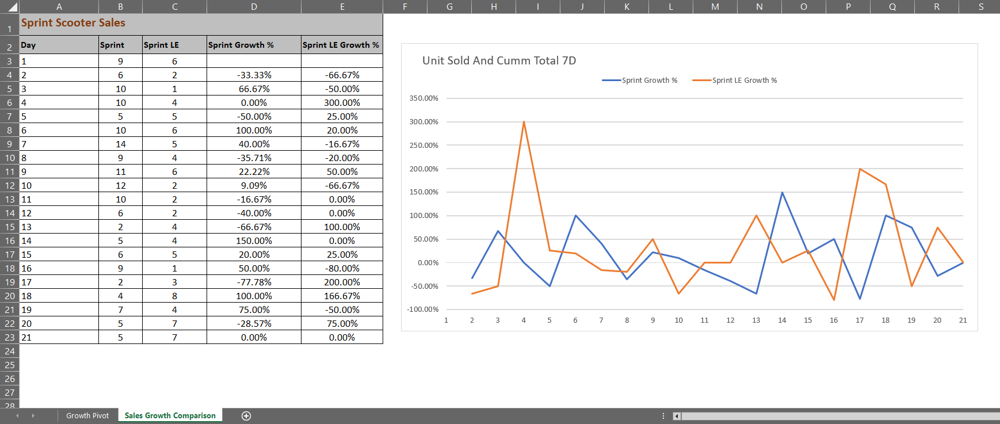

# Analyzing Electric Vehicle Sales Drop

This is a micro-experience working on a real world use-case that is obtained from [bluetick.ai](https://app.bluetick.ai/micro-experiences). It can be accesed from here: https://app.bluetick.ai/workstation/104

## Project Overview

- **Problem Statement**: Zoom Electric introduced the Sprint scooter in the 2-wheeler EV scooter segment, which initially had impressive sales. However, the sales declined unexpectedly. As a data analyst, you've been tasked with validating the sales drop and identifying the reasons for this decline.
- **Client**: Zoom Electric (ZE), a venture owned by ZOOM MOTORS India Private Limited.

Zoom Electric offers a range of automotive and scooter products, including FioNex, Sprint, and Parker, along with some exclusive limited-edition variants.
As an analyst in the Sales and Operations team at Zoom Electric, your responsibilities include managing pre-orders, facilitating client visits for sales, overseeing website sales, and analyzing website visitor data as well as sales performance. 
## Tools Used

- Microsoft SQL Server
- Microsoft Excel

## Deliverables

### 1. Quantifying the Sales Drop

- **Title**: Quantifying the Sales Drop
- **Objective**: Validating the sales decline is crucial as it provides a clear understanding of the current sales performance by examining the cumulative sales volume over a rolling 7-day period is the main objective for this deliverable. This approach allows for a consistent evaluation of sales performance throughout the week. By doing so, any potential issues or trends can be identified that may be affecting sales. This information can then be used to make informed decisions and take necessary actions to address the decline.
- **SQL Query**:
   
  
- **Query Output**:
   
  
- **Spreadsheet Model**:
   
  
 

### 2. Launch Date Assumption

- **Title**: Launch Date Assumption
- **Objective**: Zoom Electric used to launch its products usually in the first half of the year, but Sprint is the only scooter launched in the second half of the year (October). The objective of this milestone is to assess whether there is a relationship between the launch date and the sales growth experienced in the first two to three weeks. By comparing the growth percentage of the Sprint Scooter with the growth rate of the Sprint Limited Edition launched on a different production start date, assumption about the impact of the launch date can be validated. Specifically, analyzing the growth rate during the first three weeks (21 days) from the launch will provide insights into the validity of the assumption.

- **SQL Query**:
   
  
- **Query Output**:
   
  
- **Spreadsheet Model**:
   
  

### 3. Email Campaign Analysis

- **Title**: Email Campaign Analysis
- **Objective**: The objective of this deliverable is to assess the effectiveness of an email campaign in influencing customers' purchasing decisions. Analyzing the email opening rate and click-through rates, as well as comparing them to industry benchmarks, will enable the evaluation of the effectiveness and quality of the email campaign. This will provide insights into how well the campaign engages recipients, whether they open the emails, and if they click on the provided links, helping to measure the overall impact and success of the campaign.

- **SQL Query**:
   
  
- **Query Output**:
   
  
- **Spreadsheet Model**:
   
  

### 4. Conclusion

The analysis of the product sales, particularly in relation to the recent email campaign, has provided valuable insights into the performance of the campaign and its impact on sales. It is evident that the email campaign had a strong initial impact, with a higher than industry benchmark email open rate. However, the subsequent decline in product sales indicates that the campaign's overall effectiveness was limited.

### 5. Recommendation
- **Optimize Email Content**: While the email open rate was higher than the industry benchmark, the click-through rate was significantly lower. To address this issue, focus on improving the content of the emails, making them more engaging and compelling to encourage recipients to click on the provided links. This may involve using more persuasive and relevant content and calls to action.

- **Segmentation**: Consider refining the email recipient list by segmenting it based on factors such as customer preferences, behavior, or demographics. This will help to send more targeted and personalized emails to different groups, increasing the likelihood of customer engagement and conversions.

- **Follow-Up Campaigns**: Plan and execute follow-up email campaigns to re-engage those who opened the initial email but did not click through. These follow-up emails can provide additional information, incentives, or reminders to encourage action.

- **Campaign Duration**: The duration of the campaign should be at least 2 months before the launch. This will help customers provide ample amount of time to consider factors that help to make a proper decision to purchase the product.

By implementing these recommendations and continuously refining the email marketing strategy, we aim to improve the click-through rate and, subsequently, the overall sales performance of the Sprint Scooter. This proactive approach should help the product regain and sustain its market momentum.

## How to Use This Repository

- Clone the repository to your local machine.
- Use the SQL Queries present in the folder named 'SQL Queries' or from the document named 'Queries_Doc'  to perform the analysis using Microsoft SQL Server and Excel.

## License

- This project is licensed under the [License Name] - see the [LICENSE](LICENSE) file for details.

